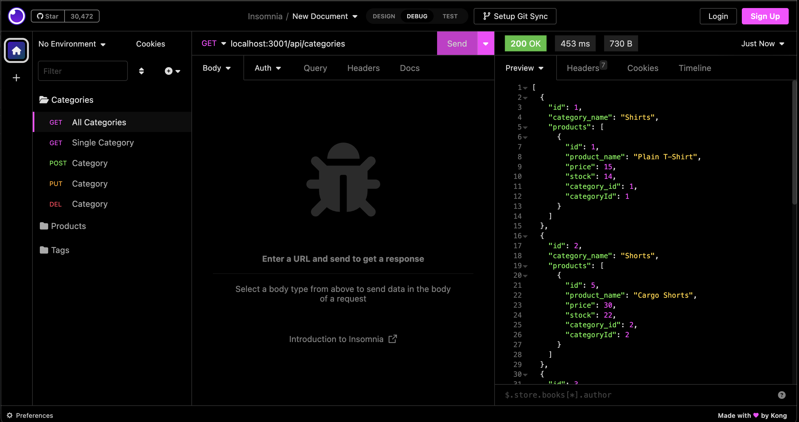
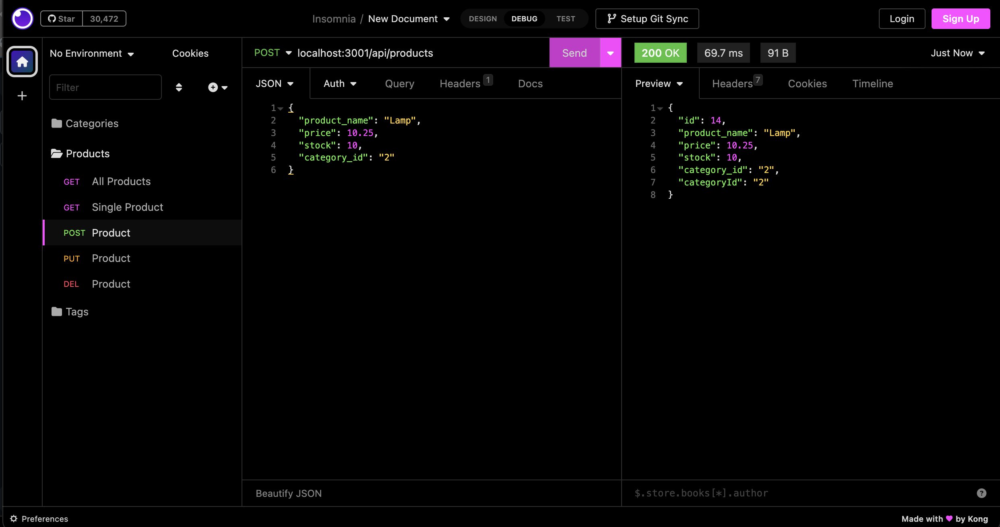
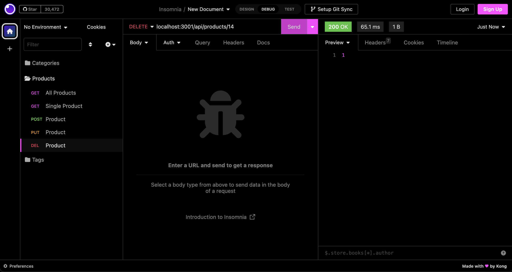

# c-13-E-commerce-ORM

## Description

UC Berkeley FullStack Coding Bootcamp provided starter code and I helped build the back end for this e-commerce site that uses Sequelize to interact with a MySQL database. I contributed to this starter code to improve my understanding of the architecture of e-commerce sites. This application is not deployed and its functionality can be seen in the video link below.

## Table of Contents

- [Installation](#installation)
- [Usage](#usage)
- [Credits](#credits)
- [License](#license)

## Installation

To be able to use this application users should clone the repo in a folder and open the application using their terminal. From the root directory of the application users must run “npm i” in their terminal which will install the dependencies needed to run this application.

### View Functionality:

[Video](https://drive.google.com/file/d/1-4bDZS_Mn9vMhDMPVB7--ldy7Xi3xPcf/view)

### View Repo:

[Repo](https://github.com/perfectblue0/c-13-E-commerce-ORM)

## Usage

Users must first seed the database; after installing dependencies users must type in “npm run seed” in their terminal. Once users have seeded the database users can enter “npm run start”.

  
  

   
## Credits

I was given starter code from the UC Berkley Fullstack Coding Bootcamp. I was able to complete this project using Kayvon Kazemi’s, TA at the bootcamp, challenge review video that covered how to get started on this challenge.

## License

Please refer to the repo.
